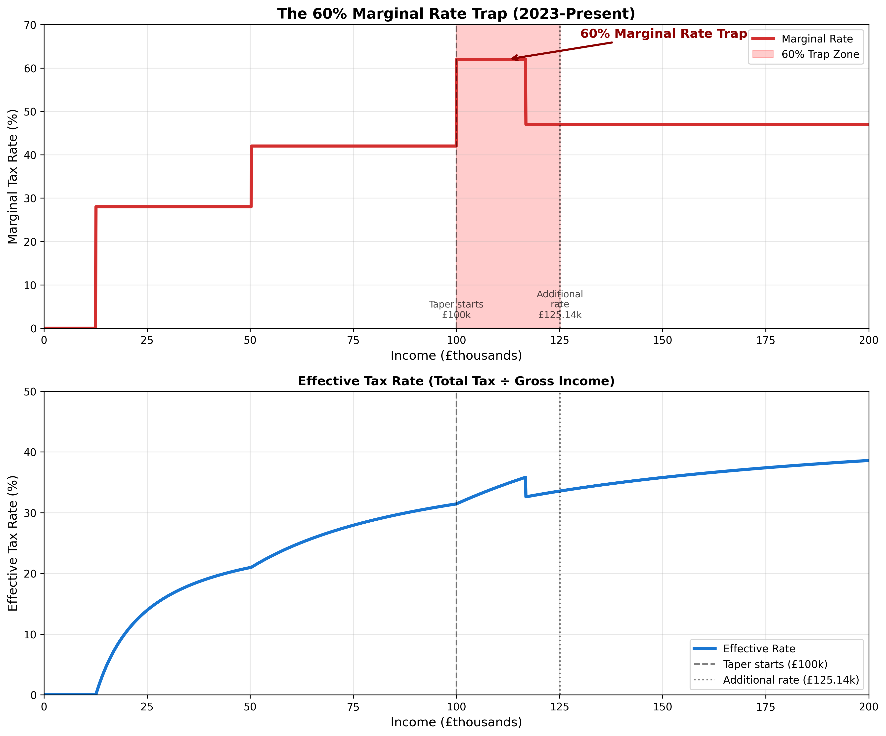
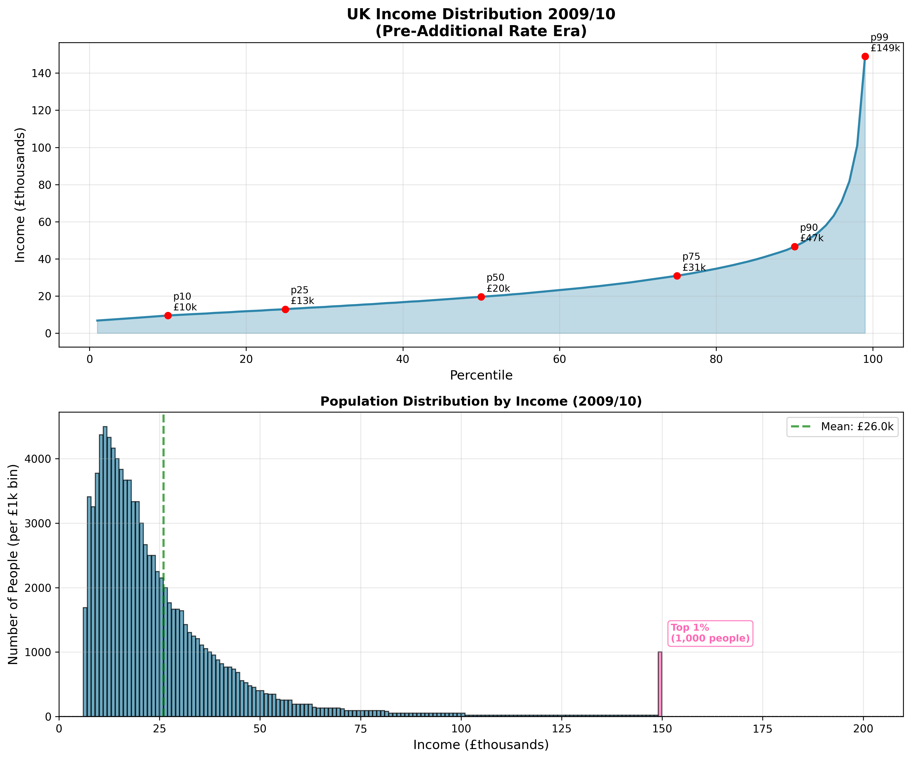
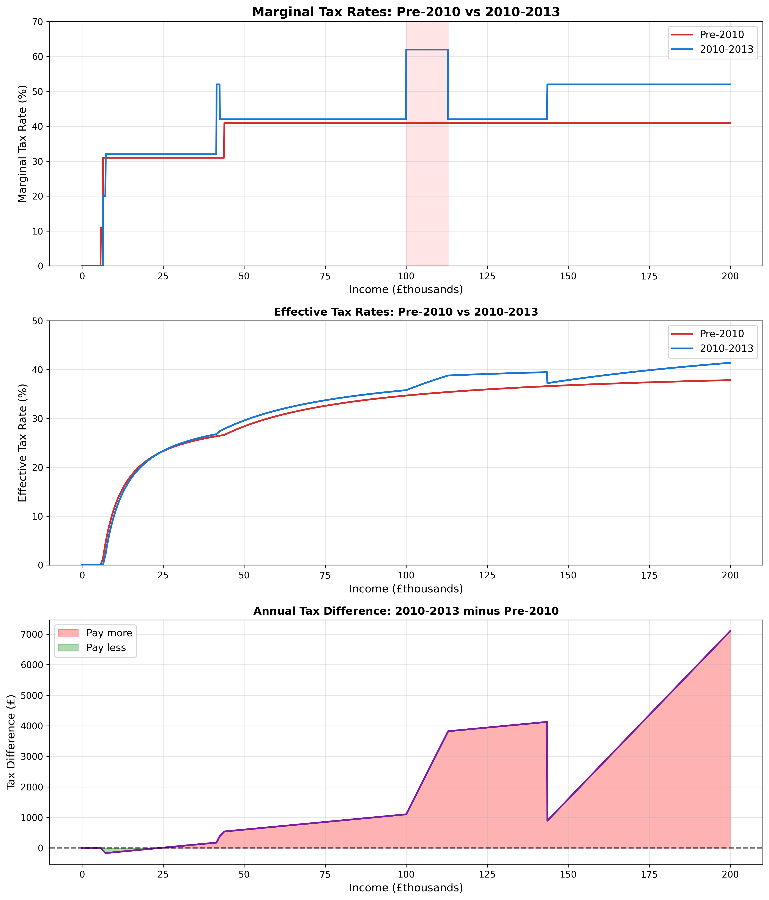
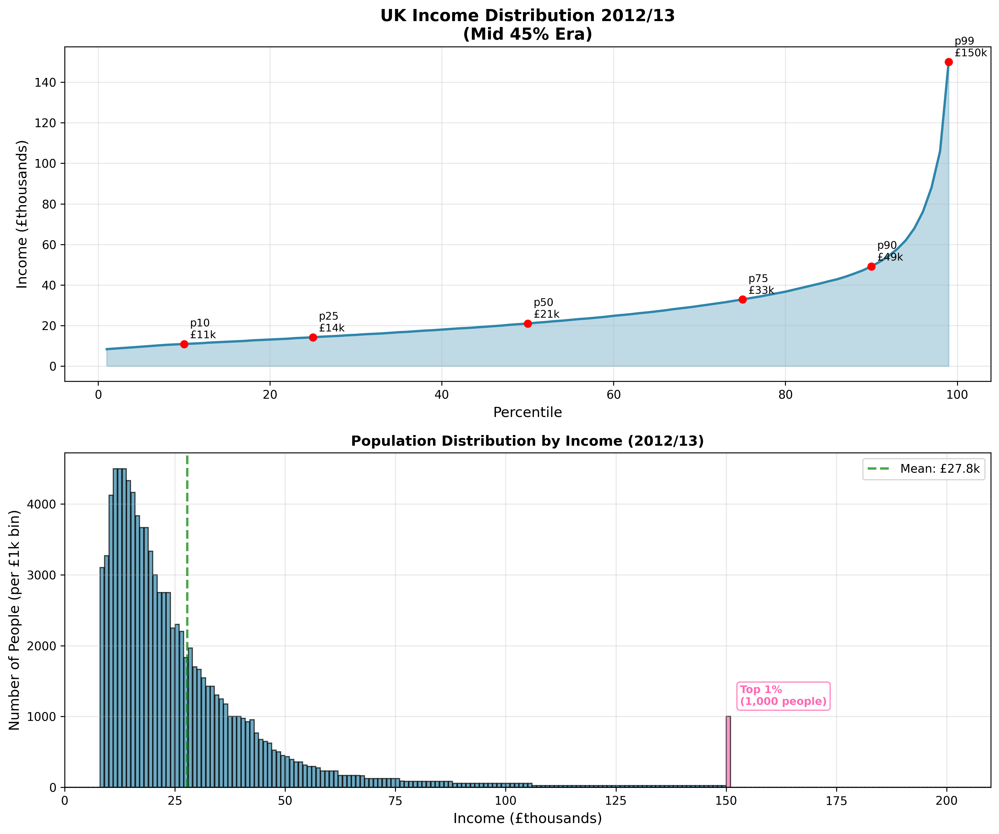
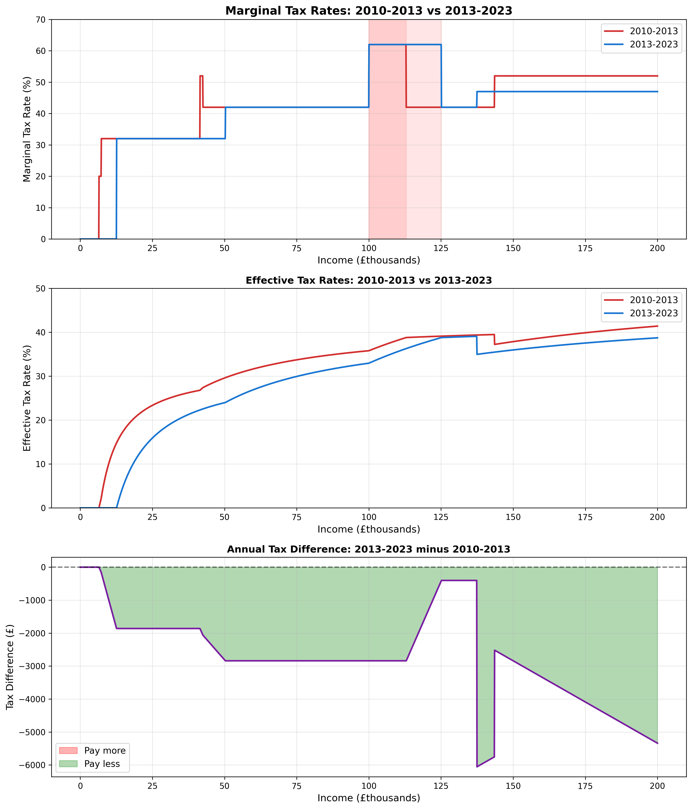
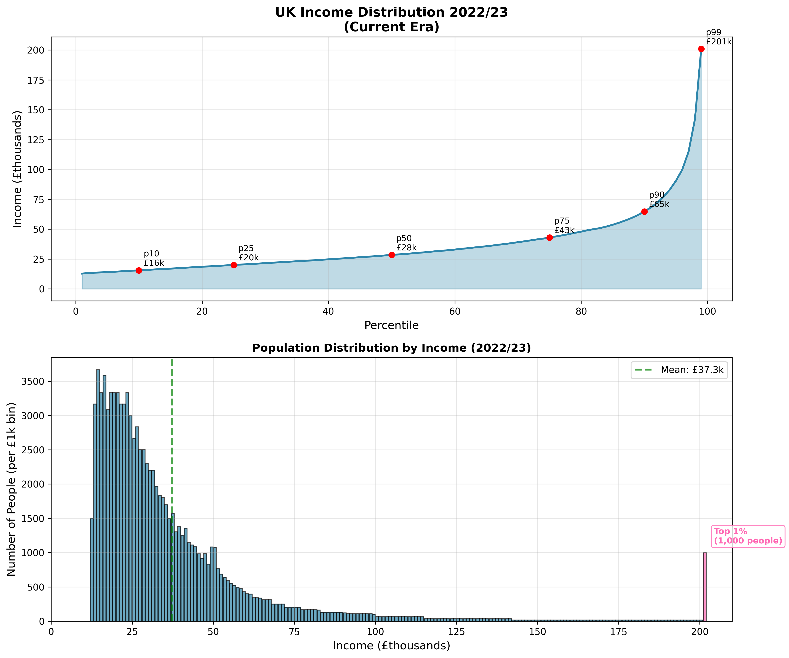
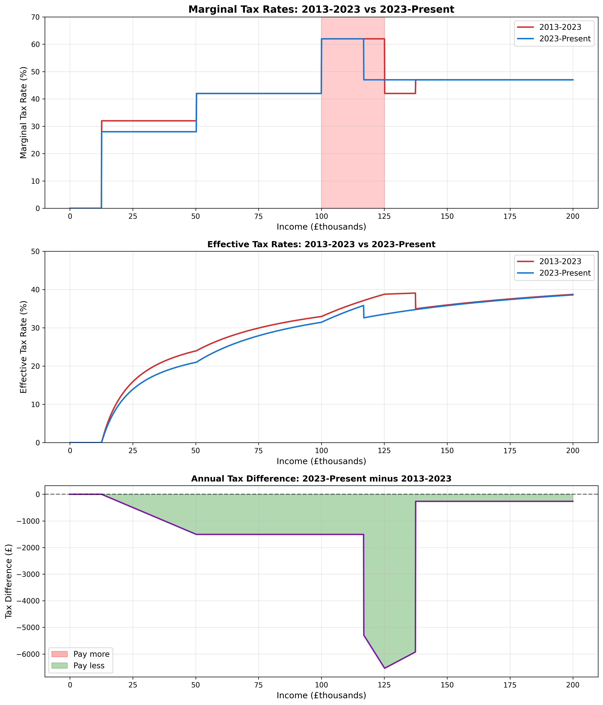
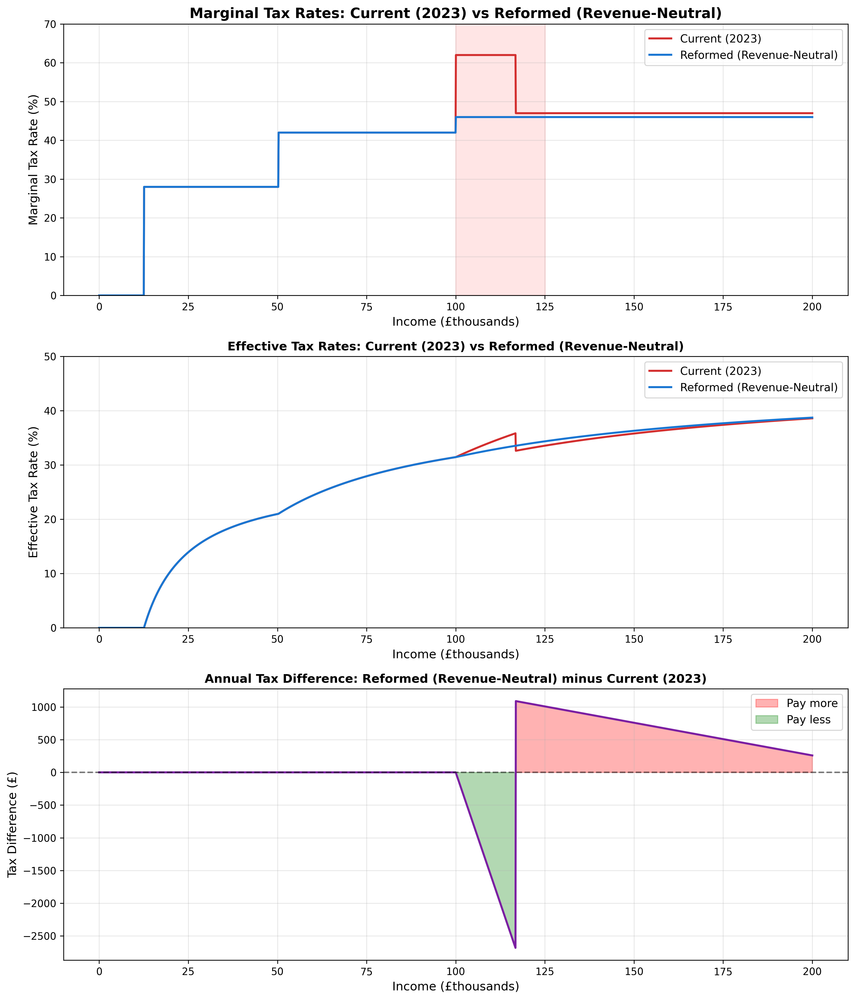
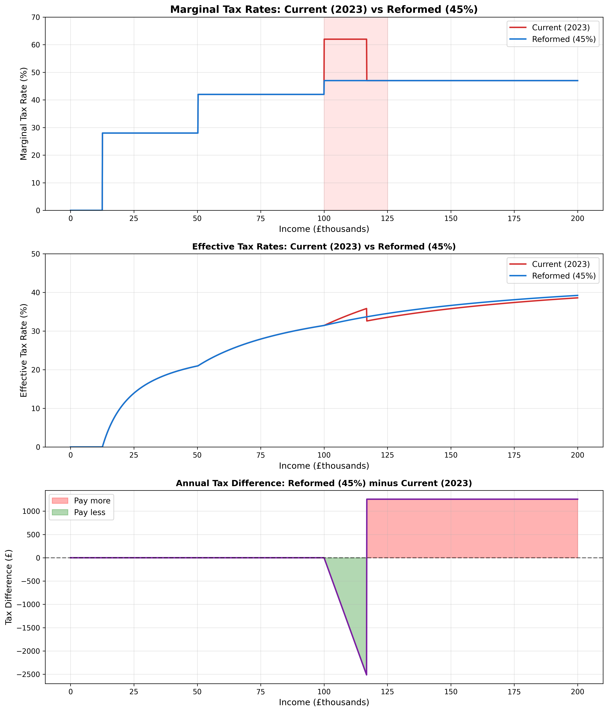

# The Evolution and Reform of the UK Tax System: A Critical Analysis of the 60% Marginal Rate Trap

## The Problem

The current UK tax system contains a significant anomaly: between £100,000 and £125,140, earners face an effective marginal tax rate of 60-62%. This "trap" occurs because the personal allowance is progressively withdrawn at a rate of £1 for every £2 earned above £100,000. Combined with the standard 40% income tax rate and 2% National Insurance, this creates a higher marginal rate than even the highest earners face above £125,140, where the "additional rate" of 45% applies. This distortion discourages work, creates perverse incentives for tax avoidance, and violates the fundamental principle that tax systems should have monotonically increasing marginal rates.

## 1. History: The Evolution of the UK Tax Trap

### 1.1. The Two-Band Era (Pre-April 2010)

Before April 2010, the UK operated a simpler two-band income tax system. The personal allowance was £6,475 and remained constant regardless of income—there was no tapering mechanism. Income tax rates were straightforward: 20% on taxable income up to £37,400, and 40% on everything above. National Insurance contributions were charged at 11% between the lower and upper earnings limits, then 1% above.

This system was characterized by its simplicity and the absence of any marginal rate anomalies. While the overall tax burden could be debated, the system at least maintained a logical progression: as you earned more, you never faced a higher marginal rate than those earning even more than you.

**Tax Revenue Estimate (2009/10):** Using the Pre-2010 calculator on a population of 100,000 with the 2009/10 income distribution, the system would generate approximately **£657.7 million** in total revenue (£467.9 million income tax, £189.8 million National Insurance). The mean income was £26,038.

### 1.2. The Introduction of the "Additional Rate" (2010-2013)

The financial crisis of 2008 prompted a significant policy shift. In April 2010, the government introduced two major changes:

1. **A 50% additional rate** on incomes above £150,000
2. **Personal allowance tapering** beginning at £100,000, withdrawn at £1 for every £2 earned

National Insurance rates also increased: the main rate rose from 11% to 12%, and the higher rate from 1% to 2%.

While the stated aim was to ensure high earners contributed more, the tapering mechanism inadvertently created the 60% marginal rate trap between £100,000 and approximately £112,950 (where the personal allowance was fully withdrawn). This was the birth of the anomaly that persists today.

**Impact Analysis (transition from Pre-2010 to 2010-2013 system using 2010/11 data):**

- **Winners (pay less):** 62,200 people (62.2%) saved an average of **£90/year**
- **Losers (pay more):** 37,800 people (37.8%) paid an average of **£404/year** more
- **Net revenue increase:** £9.7 million

The majority of taxpayers saw slight reductions due to increased personal allowances and threshold adjustments, but high earners faced significantly higher bills. The 60% trap affected a relatively small number of people initially, as fewer earners fell in this range during the post-crisis period.

### 1.3. The 45% Adjustment Era (2013-2023)

In April 2013, the government reduced the additional rate from 50% to 45%, arguing that the 50% rate raised less revenue than expected due to behavioral responses and tax avoidance. The personal allowance was gradually increased over this period, reaching £12,570 by 2021, where it has since been frozen. The tapering mechanism remained unchanged: starting at £100,000, the allowance reduces by £1 for every £2 earned, reaching zero at £125,140.

The additional rate threshold remained at £150,000, meaning the 60% trap now extended from £100,000 to £125,140—a significantly wider range than before. Despite the lower additional rate, the trap actually worsened because the enlarged personal allowance meant the taper affected a longer income range.

**Impact Analysis (transition from 2010-2013 to 2013-2023 system using 2013/14 data):**

- **Winners (pay less):** 99,999 people (100.0%) saved an average of **£1,935/year**
- **Losers (pay more):** 0 people (0%)
- **Net revenue decrease:** £193.5 million

This was overwhelmingly a tax cut, primarily driven by the increased personal allowance and the reduction in the additional rate from 50% to 45%. The broader population benefited significantly, though the 60% trap remained embedded in the system, now affecting a wider income range.

### 1.4. The Alignment Era (2023-Present)

In April 2023, a subtle but significant change occurred: the additional rate threshold was reduced from £150,000 to £125,140—precisely the point where the personal allowance reaches zero after tapering. This "alignment" was ostensibly to simplify the system, but it had an important consequence: it intensified the 60% trap's impact.

Previously, there was a "relief zone" between £125,140 and £150,000 where the marginal rate dropped back down to 42% (40% income tax + 2% NI). Now, earners immediately jump from the 60-62% trap at £125,140 to the 47% additional rate zone (45% + 2% NI). While 47% is still lower than 60%, the removal of the relief zone makes the trap's effect more severe.

Additionally, National Insurance rates were cut: the standard rate reduced from 12% to 8% in 2024/25. This benefits lower and middle earners significantly but does little to address the 60% trap, which is primarily caused by the personal allowance taper, not NI rates.

**Impact Analysis (transition from 2013-2023 to 2023-Present system using 2022/23 data):**

- **Winners (pay less):** 98,499 people (98.5%) saved an average of **£757/year**
- **Losers (pay more):** 0 people (0%)
- **Net revenue decrease:** £74.6 million

The National Insurance cut was another broad-based tax reduction, benefiting almost everyone. Despite the reduction in the additional rate threshold (which increased taxes for those earning above £125,140), the overall effect was a net tax cut due to the substantial NI reduction.

**Current System Revenue (2023-Present using 2022/23 data):** £801.7 million total revenue for 100,000 people (£640.9 million income tax, £160.9 million NI). Mean income: £37,292.

## 2. Reform: Eliminating the Trap

Reforming the tax system to eliminate the 60% trap while maintaining fairness and revenue neutrality is challenging. Any reform must balance multiple objectives:

- **No change for incomes below £100,000:** The trap only affects higher earners, and any reform should not disadvantage the broader population.
- **Monotonic marginal rates:** The marginal tax rate should never decrease as income increases, and ideally should be monotonically increasing or at least constant within bands.
- **Revenue sustainability:** The government requires a certain level of tax revenue to fund public services.

The most straightforward solution is to **remove the personal allowance taper entirely** and adjust the higher rate threshold to coincide with where the trap currently begins (£100,000). This immediately eliminates the 60% trap, as everyone retains the full £12,570 personal allowance regardless of income. However, this results in lower tax revenue from high earners, which must be offset by adjusting the additional rate upward.

### 2.1. Revenue-Neutral Reform: Optimized Additional Rate

To maintain the same total tax revenue as the current system (£801.7 million), the reformed system removes the personal allowance taper and sets the higher rate threshold at £100,000. Using optimization techniques, we find that an **additional rate of 44.0%** (rather than the current 45%) achieves revenue neutrality.

**Reformed System Characteristics:**
- Personal allowance: £12,570 for everyone (no taper)
- Basic rate: 20% (£12,571 - £50,270)
- Higher rate: 40% (£50,271 - £100,000)
- Additional rate: **44.0%** (above £100,000)
- National Insurance: 8% (£12,571 - £50,270), 2% (above £50,270)

**Impact Analysis (Current system → Revenue-Neutral Reform using 2022/23 data):**

- **Winners (pay less):** 2,067 people (2.1%) save an average of **£694/year**
  - Total savings: £1,434,166
- **Losers (pay more):** 1,925 people (1.9%) pay an average of **£745/year** more
  - Total costs: £1,434,166
- **Unchanged:** 96,006 people (96.0%)
- **Net revenue change:** £0 (perfectly revenue neutral)

**Who Benefits?** Those caught in the 60% trap (£100,000 - £125,140) benefit significantly, saving hundreds to thousands of pounds per year. The elimination of the trap also removes the incentive for tax avoidance behaviors in this income range.

**Who Pays More?** High earners above approximately £155,000 face slightly higher marginal rates (44.0% instead of 45% below £125,140), but the increase is minimal. The reform creates a balanced distribution where those who benefit from eliminating the trap pay slightly more above £155,000, and the system is now internally consistent with no anomalous rate spikes.

### 2.2. Reformed System with 45% Additional Rate

An alternative reform maintains the current 45% additional rate while removing the taper and setting the higher rate threshold at £100,000. This results in slightly higher total revenue (£804.1 million, an increase of £2.4 million) while still eliminating the 60% trap.

**Reformed System Characteristics:**
- Personal allowance: £12,570 for everyone (no taper)
- Basic rate: 20% (£12,571 - £50,270)
- Higher rate: 40% (£50,271 - £100,000)
- Additional rate: **45%** (above £100,000)
- National Insurance: 8% (£12,571 - £50,270), 2% (above £50,270)

**Impact Analysis (Current system → 45% Reform using 2022/23 data):**

- **Winners (pay less):** 1,067 people (1.1%) save an average of **£1,213/year**
  - Total savings: £1,295,327
- **Losers (pay more):** 2,925 people (2.9%) pay an average of **£1,257/year** more
  - Total costs: £3,677,889
- **Unchanged:** 96,006 people (96.0%)
- **Net revenue change:** +£2.4 million

This variant is more politically palatable than raising the additional rate to 50.4%, as it maintains the current nominal top rate. The trade-off is that high earners above £150,000 see smaller tax increases (only £1,257/year on average rather than £5,504/year), while those in the trap still benefit substantially. The system generates slightly more revenue overall because the removal of the taper brings more income into the tax base at higher rates.

## Conclusion

The UK tax system's evolution since 2010 has inadvertently created a significant policy failure: the 60% marginal rate trap. What began as a well-intentioned attempt to increase tax contributions from high earners has resulted in a system that violates basic principles of tax design, creates perverse incentives, and penalizes those earning £100,000-£125,140 more heavily than those earning substantially more.

The historical analysis reveals that this trap was not designed deliberately but emerged from the interaction of multiple policy changes: the introduction of the personal allowance taper in 2010, the increase in the personal allowance to £12,570, and the recent alignment of the additional rate threshold with the taper endpoint.

Reform is both necessary and achievable. By eliminating the personal allowance taper and adjusting the additional rate threshold to £100,000, we can create a fairer, more efficient tax system. Whether the additional rate is set at 45% (with a small revenue increase) or 44% (for strict revenue neutrality), the benefits are clear:

- **Fairness:** Marginal rates increase monotonically with income, without anomalous spike zones.
- **Efficiency:** Removes incentives for tax avoidance and distortionary behavior in the £100k-£125k range.
- **Simplicity:** The personal allowance is the same for everyone, making the system easier to understand.
- **Limited impact:** 96% of taxpayers are unaffected, with only 4% seeing changes (1% winners, 3% paying more).

The question is not whether the trap should be fixed, but when policymakers will prioritize systemic coherence over the inertia of incremental change. The evidence from over a decade of this flawed system is clear: it is time to reform.

---

*Analysis based on UK income distribution data (1999/00 - 2022/23) and tax calculator simulations. Code and methodology available at [github.com/yourrepo/uktax](https://github.com/yourrepo/uktax).*
